# The Model Flywheel: Shadow Distillation and Router Fine-Tuning

**Version:** 1.0
**Status:** Proposal
**Scope:** Three new decision plugins (`shadow_dispatch`, `model_distillation`, `mom_finetune`), one job contract, one campaign controller.

## Abstract

vLLM Semantic Router already decides *which* model serves a request. This proposal
extends it to improve *the models themselves* — turning vSR into the substrate for a
data-and-model flywheel that any vertical-domain agent can run against its own traffic.

The loop is: run a small model in shadow behind a large one, judge where the small
model diverges, distill the large model's behavior into the small one on exactly those
cases, re-shadow to measure the gap closing, then fine-tune a vSR classifier that
escalates to the large model only for the residual cases the distilled model still
cannot handle. Every stage is a job with a typed spec and status; a campaign
controller sequences them with explicit gates.

Nothing in the core routing path changes semantics. The flywheel is additive: three
recipe-scoped plugins, a job contract with pluggable executors, and generated config
that flows through the existing deploy path.

## The Flywheel



Each turn of the wheel does two things at once: it makes the small model *more capable*,
and it makes the router *better at knowing where that capability ends*. Step 5 is what
converts a merely-cheaper model into a cheaper system, because a distilled model with no
escalation policy is only as trustworthy as its worst case.

The dotted return edge is the recursion. Round *n+1* uses the same shadow apparatus as
round *n* — the distilled student simply takes the candidate arm — so there is no separate
"second iteration" machinery to build.

## Motivation

A vertical-domain agent team that wants a cheap, fast, domain-specialized model faces
the same four problems every time:

1. **They have no domain data.** Public benchmarks do not resemble their traffic.
2. **They cannot tell whether a small model is good enough** without risking production.
3. **Distillation is a project, not a step** — collecting pairs, judging them, wiring a
   training framework, evaluating the result.
4. **Even a good distilled model has a tail** it cannot serve, and routing that tail
   correctly is its own ML problem.

vSR is already positioned at the exact point where all four are solvable: it sees every
request, already dispatches to heterogeneous backends, already captures routing signals
and typed outcomes, and already owns the routing decision that the fourth problem needs.
What is missing is the machinery to *close the loop*.

### Why this belongs in vSR rather than beside it

The alternative is an external pipeline that reads vSR's logs. That fails on three counts:

- The shadow arm must be dispatched from the routing layer to reuse recipe scoping,
  backend health, retry policy, auth, and PII handling. Re-implementing that outside is
  duplicating the router.
- The output of the loop is a routing change. A pipeline that cannot write decision
  rules cannot close the loop.
- The judge wants the routing signals (domain, complexity, fact-check, jailbreak) that
  only vSR computes, and it wants them on the same record as the two responses.

## Non-Goals

- **Not a training framework.** Distillation and fine-tuning run in LLaMA-Factory, TRL,
  or a user-supplied executor. vSR owns configuration, data, triggering, and promotion —
  not gradients.
- **Not an inference server.** vSR does not host the distilled model. It registers a
  backend that the user (or their operator) serves.
- **Not automatic by default.** `promotion: auto` is opt-in per campaign. The default
  campaign stops at each gate and waits for a human.
- **Not logit-level knowledge distillation.** Teacher logprobs are unavailable from most
  hosted endpoints. See [Distillation method](#distillation-method).
- **No change to per-query routing semantics.** The flywheel produces config; the
  existing decision engine consumes it unchanged.

## Existing Building Blocks

This proposal is deliberately small because most of the substrate exists. Naming what we
reuse is the load-bearing part of the design.

| Capability | Existing surface | How the flywheel uses it |
|---|---|---|
| Recipe-scoped plugin extension | `DecisionPlugin{Type, Configuration}`, registered in `src/semantic-router/pkg/config/routing_surface_catalog.go` | All three new plugins register here. No new extension mechanism. |
| Durable request capture | `pkg/routerreplay/store/` — `factory.go` over memory, Postgres, Milvus, Qdrant, Redis | Shadow arms and judge verdicts extend the replay record. No new store. |
| Typed post-route feedback | `store.Outcome{Source, Target, Verdict, Score, Reason, Metadata}` | Judge verdicts *are* `Outcome` records. |
| Routing signal capture | `store.Signal` — domain, complexity, fact_check, jailbreak, PII, and 15 more | Becomes the feature context for judging and for escalation-classifier training. |
| Candidate → shadow → active → retired lifecycle | `pkg/selection/policy_version.go`, `pkg/selection/model_switch_gate.go` (`shadow`/`enforce` modes), `llm_shadow_comparison_*` metrics | The promotion state machine and its vocabulary are reused for model and classifier artifacts. |
| Generic named classifiers as routing signals | `pkg/classification/classifier_signal_generic.go`; `routing.signals.classifiers[]`; `conditions: [{type: classifier, name, label, predicate}]` | The fine-tuned escalation head registers here. **No new signal type is needed.** |
| Job runner with progress streaming | `dashboard/backend/mlpipeline/runner.go` — `Job{ID, Type, Status, Progress, CurrentStep}`, SSE, subprocess trainers | Extended with flywheel job types and a pluggable executor. |
| Classifier fine-tuning scripts | `src/training/model_classifier/**` (BERT + LoRA), `common_lora_utils.py` | The escalation-classifier trainer follows the established pattern. |
| Config deploy path | `dashboard/backend/handlers/config_projection.go`, `deploy.go`, `runtime_config_apply.go` | Generated decision rules deploy through the normal reviewed path. |
| Evaluation | `src/training/model_eval/` incl. `mom_collection_eval.py`, `signal_eval.py` | Gate evidence for promotion. |

The genuinely new things are: **dispatching a second arm and recording it**, **judging
the divergence into a verdict**, **rendering a training run for an external framework**,
and **sequencing the stages behind gates**. Everything else in this proposal is
composition over surfaces that already exist.

## Architecture



The flywheel **alternates** between the two layers, and two properties of that alternation
are load-bearing.

**Only shadow dispatch and capture run in the request path.** Every control-plane stage is
offline, restartable, and structurally incapable of affecting a live request. The sole
edge back into routing is a *proposed config change* travelling through the review and
deploy path the repository already has.

**Distillation and router fine-tuning are sequential, not parallel.** They consume
different dataset revisions, produced a full round apart. Pass 1 trains the student on
where the *base* student failed. The distilled model must then be registered and
re-shadowed — a complete trip back through the data path — before pass 2 can exist,
because the router's training labels are the residual failures of the *distilled* student,
which are unknowable until it has been observed against real traffic. Fine-tuning the
router against round 1 verdicts would teach it to escalate the cases distillation just
fixed, which is the failure mode this ordering exists to prevent. Each subsequent turn of
the flywheel repeats the same alternation with the previous student as the new baseline.

## Component 1: `shadow_dispatch` plugin (data path)

### Responsibility

Mirror a request to one or more candidate backends, discard their responses, and record
each response as an arm on the replay record. Nothing else.

This plugin is independently useful without the rest of the flywheel — it is the
canary/A-B primitive vSR currently lacks.

### Contract

- **The client never waits.** The primary response streams back on the normal path.
  Shadow dispatch happens on a detached goroutine with its own budget.
- **The client never sees shadow output.** Shadow responses are recorded, never merged,
  never returned. This is what distinguishes it from `pkg/looper`'s fusion path, which
  composes multiple model outputs into one answer.
- **A shadow failure is never a request failure.** Shadow errors are recorded as arm
  status and counted in metrics; they do not propagate.
- **Shadow arms are bounded.** Concurrency, per-arm timeout, and sampling rate are all
  configured, with conservative defaults, so shadow traffic cannot starve primary
  traffic or the backend pool.

### Configuration

```yaml
plugins:
  - type: shadow_dispatch
    configuration:
      enabled: true
      # Fraction of matched requests mirrored. 1.0 during a bootstrap campaign
      # against an eval corpus; low single-digit percent against live production.
      sample_rate: 0.05
      # Requests already served from cache are skipped: there is no fresh
      # primary output to compare against.
      skip_cached: true
      arms:
        - name: small-candidate
          model: qwen3-8b            # must exist in providers.models
          role: candidate            # candidate | baseline
          timeout: 30s
        - name: distilled-v2
          model: qwen3-8b-distilled-v2
          role: candidate
          timeout: 30s
      limits:
        max_concurrent_shadow: 16    # global in-flight shadow requests
        queue_depth: 256             # shed beyond this; shedding is a counter
        max_response_bytes: 65536    # per arm, before storage
      capture:
        # Bodies are needed for distillation, so this plugin needs a larger
        # budget than router_replay's 4096-byte debugging default. See
        # "Storage cost" below.
        request_body: true
        response_body: true
        redaction: from_pii_signal   # from_pii_signal | none | strict
```

### Data model

The replay record gains one field. This is the only schema change in the data path.

```go
// pkg/routerreplay/store/store.go

// ShadowArm records one mirrored dispatch alongside the primary response.
type ShadowArm struct {
    Name       string     `json:"name"`
    Model      string     `json:"model"`
    Role       string     `json:"role"`
    Status     string     `json:"status"`  // ok | timeout | error | shed
    Error      string     `json:"error,omitempty"`
    Response   string     `json:"response,omitempty"`
    LatencyMs  int64      `json:"latency_ms"`
    Usage      *UsageCost `json:"usage,omitempty"`
    // ModelVersion pins which artifact produced this response, so a campaign
    // can distinguish round-1 baseline arms from round-2 distilled arms over
    // the same prompt distribution.
    ModelVersion string   `json:"model_version,omitempty"`
}
```

The record gains a corresponding `ShadowArms` slice field, tagged
`json:"shadow_arms,omitempty"`. Every existing backend serializes the record through `postgres_record_codec.go` and the
generic JSON paths, so the four durable backends pick this up without per-backend work;
`postgres_record_row.go` gains one column.

### Storage cost

This is the sharpest trade-off in the design and deserves an explicit answer.

`router_replay` defaults to `max_body_bytes: 4096` because it exists for debugging.
Distillation needs full bodies. A campaign that mirrors 5% of 1M daily requests at ~4KB
of combined prompt and response stores roughly 200MB/day.

The design handles this with three levers rather than by removing the cap:

1. **Sampling is the primary lever.** Distillation needs thousands of *failure* cases,
   not millions of requests. A campaign that has collected its target failure count
   stops sampling — the controller drives `sample_rate` to zero at the collection gate.
2. **Retention is per-campaign, not global.** Shadow-bearing records carry a campaign
   label and a retention policy independent of the replay ring's `max_records`.
3. **Post-export pruning.** Once a dataset revision is exported and checksummed, source
   record bodies for judged-correct cases are prunable; the verdict and signals remain.

If a deployment outgrows this, the escape hatch is the third option we considered:
metadata and verdict in the replay store, bodies in object storage behind a pointer. The
`ShadowArm.Response` field becomes a URI. That is a contained change and is explicitly
left as a future extension rather than built now.

### Privacy

Shadow capture stores production prompts, so this is a governance surface, not just a
storage one.

- `redaction: from_pii_signal` (the default) applies the existing PII classifier's spans
  before persisting either arm. vSR already computes the PII signal; the flywheel reuses
  it rather than inventing a second detector.
- `redaction: strict` refuses to capture any record where the PII signal fired at all.
- Shadow dispatch to a backend whose `backend_refs` leave the deployment's trust boundary
  is a distinct decision from routing there. Config validation rejects an arm pointing at
  an external provider unless `allow_external_shadow: true` is set explicitly, so
  mirroring production traffic to a third party is never accidental.
- Records inherit the existing redaction path in `dashboard/backend/handlers/log_redaction.go`
  for anything surfaced in the UI.

### Metrics

Following the naming already used by `llm_shadow_comparison_*`:

- `llm_shadow_dispatch_total{arm, model, status}`
- `llm_shadow_dispatch_latency_seconds{arm, model}`
- `llm_shadow_dispatch_shed_total{arm, reason}`
- `llm_shadow_arm_inflight{arm}`

## Component 2: judging and capture

### Responsibility

Convert `(prompt, primary_response, shadow_response, signals)` into a verdict, written as
an existing `store.Outcome`.

Judging is a **control-plane job**, not a data-path step. The data path records; the
judge job reads records and writes outcomes. This keeps the hot path cheap and — more
importantly — lets a campaign re-judge the same captures under different criteria without
re-collecting data, which is the difference between a one-shot experiment and a flywheel.

### Strategies

Configured per campaign. All four write the same `Outcome` shape.

| Strategy | Mechanism | When it fits |
|---|---|---|
| `llm_judge` (default) | A judge model scores the shadow response against the primary as reference, returning a score and reason. | General case; no ground truth available. |
| `signal` | Reuses vSR's own detectors — NLI/entailment (`pkg/looper/confidence.go`), grounding (`grounding.go`), the hallucination plugin — to score agreement. | Cheap, local, no extra model serving. Good for high-volume screening before an expensive `llm_judge` pass. |
| `eval_harness` | Scores both arms against ground truth via `src/training/model_eval/`. | The agent has a real eval system — your "run testing cases to obtain data" mode. Strongest signal available. |
| `webhook` | POSTs the tuple to a user endpoint, expects a verdict. | Domain-specific correctness the platform cannot know (a legal or clinical rubric). |

```yaml
judge:
  strategy: llm_judge
  llm_judge:
    model: qwen3-32b               # commonly the teacher itself
    threshold: 0.7                 # below → shadow arm judged failing
    rubric: |
      Score 0-1 how well the CANDIDATE answer preserves the factual content,
      correctness, and actionable substance of the REFERENCE answer.
      Formatting and verbosity differences are not penalized.
    max_concurrency: 8
  # A cheap screen before the expensive judge. Optional.
  prefilter:
    strategy: signal
    skip_if_agreement_above: 0.95
```

### Verdict record

```go
Outcome{
    Source:    "flywheel.judge",
    Target:    "shadow_arm",
    TargetRef: "<arm name>",
    Verdict:   "pass" | "fail" | "error" | "skipped",
    Score:     0.42,
    Reason:    "omits the dosage contraindication present in the reference",
    Metadata: map[string]string{
        "campaign":      "clinical-intake-v1",
        "round":         "1",
        "strategy":      "llm_judge",
        "judge_model":   "qwen3-32b",
        "model_version": "qwen3-8b@base",
    },
}
```

Because this is the existing `Outcome` type, verdicts are queryable, exportable, and
visible in the replay UI on day one.

### Judge quality is the weakest link — and is measured

An LLM judge that is wrong 20% of the time poisons the distillation set. The design
treats judge calibration as a first-class artifact rather than an assumption:

- A campaign may configure a `calibration_set`: human-labeled examples the judge is run
  against before any judging pass. Agreement rate is recorded on the campaign and
  surfaced at the collection gate.
- Judge agreement below a configured floor **blocks** the distillation gate by default.
- Verdicts carry `strategy` and `judge_model` in metadata so a dataset revision can be
  attributed to — and invalidated by — a specific judge configuration.

### Dataset export

A dataset revision is an immutable, checksummed selection over judged records.

```yaml
dataset:
  name: clinical-intake-failures
  select:
    campaign: clinical-intake-v1
    round: 1
    verdict: fail
    score_below: 0.7
    arm: small-candidate
  balance:
    # Failures cluster in a few domains; unbalanced data teaches the student
    # that cluster rather than the teacher's capability.
    by_signal: domain
    max_per_bucket: 2000
  dedupe:
    method: embedding      # exact | embedding
    threshold: 0.95        # reuses the existing embedding path
  split:
    train: 0.9
    eval: 0.1
    seed: 42
  format: sharegpt         # sharegpt | alpaca | openai_messages | jsonl_raw
  output: file://./flywheel/datasets/clinical-intake-failures/
```

Export produces JSONL shards plus a manifest carrying the selection query, record count,
checksum, judge configuration, and source model versions. **A trained artifact always
points at a dataset revision, and a dataset revision always points at its judge
configuration.** That chain is what makes a regression debuggable three rounds later.

## Component 3: `model_distillation` plugin (control plane)

### Responsibility

Own the student-model side of the loop: dataset → training job → artifact → backend
registration → re-shadow.

### Distillation method

Black-box supervised fine-tuning on `(prompt → teacher output)` pairs restricted to cases
where the student failed, with LoRA as the default adapter method.

This choice follows from a constraint rather than a preference: the teacher is reached
through an OpenAI-compatible endpoint. Logit-level KD needs teacher token distributions
that hosted endpoints do not expose, and co-located teacher and student, which defeats
the point of routing to a hosted large model. Black-box SFT works against any endpoint
vSR can already route to — which is the entire supported surface.

Preference optimization (DPO/KTO) is a natural extension, since shadow mode produces
`(chosen=teacher, rejected=student)` pairs for free. The dataset exporter emits the
preference format behind `format: preference`, so adding a DPO trainer adapter later
requires no new data plumbing. It is not in the initial scope.

### Configuration

```yaml
plugins:
  - type: model_distillation
    configuration:
      enabled: true
      teacher:
        model: qwen3-32b
      student:
        model: qwen3-8b
        base_model_id: Qwen/Qwen3-8B-Instruct
      dataset:
        ref: clinical-intake-failures
      training:
        framework: llamafactory        # llamafactory | trl | custom
        method: lora
        # Passed through to the framework verbatim. vSR validates that the
        # keys are known to the selected adapter and does not interpret them.
        hyperparameters:
          lora_rank: 16
          lora_alpha: 32
          learning_rate: 5.0e-5
          num_train_epochs: 3
          per_device_train_batch_size: 4
          gradient_accumulation_steps: 8
          cutoff_len: 4096
        resources:
          device: cuda
          gpus: 1
      output:
        artifact_dir: file://./flywheel/models/
        register_as: qwen3-8b-distilled-v2
      evaluation:
        # Held-out eval before the artifact is eligible for promotion.
        suites: [mmlu_pro, domain_eval]
        baseline: qwen3-8b
        require_no_regression_on: [mmlu_pro]
```

### Framework adapters

An adapter renders vSR config into a framework invocation and parses back progress and
artifacts. It does not wrap or reimplement the framework.

```go
// dashboard/backend/mlpipeline/distill/adapter.go

type TrainingAdapter interface {
    Name() string
    Validate(spec DistillSpec) error
    // Render produces the framework-native config file and argv. Written to
    // the job workspace so a user can reproduce the run by hand — the config
    // is an artifact, not a hidden implementation detail.
    Render(spec DistillSpec, workspace string) (Invocation, error)
    Parse(line string) (Progress, bool)
    Collect(workspace string) (Artifact, error)
}
```

Ships with `llamafactory` and `trl`. `custom` runs a user command with the workspace and
dataset paths in the environment, which is the escape hatch for any framework we do not
adapt.

**Rendered configs are written to the job workspace and retained.** A user who wants to
take the training run out of vSR and run it on their own cluster can, and a user
debugging a bad run can see exactly what was executed.

### Model registration and re-shadow

On success the plugin proposes — never silently applies — a `providers.models` entry for
the distilled artifact and a `shadow_dispatch` arm pointing at it. Both flow through the
existing config projection and deploy path, so the human review step is the one the
repository already has.

**Round 2 is not a new mechanism.** Adding the distilled arm and re-running collection
against the same prompt distribution is the same shadow-dispatch plugin with a second
arm. That is the property that makes the flywheel recursive rather than a one-shot
pipeline: the measurement apparatus for round *n+1* is the apparatus from round *n*.

The comparison that matters — did distillation actually transfer teacher capability? — is
a query over two rounds of arms on the same prompts, reported as failure-rate delta with
a confidence interval.

## Component 4: `mom_finetune` plugin (control plane)

### Responsibility

Train the escalation classifier and generate the decision rules that use it.

### What it learns

A binary head over the request text plus routing signals, predicting: *will the distilled
student handle this acceptably?* The training labels already exist — they are the judge
verdicts from the most recent round, against the distilled arm.

```
input:  request text  (+ optional signal features: domain, complexity, structure)
label:  SERVE_SMALL   ← the judged verdict for the distilled arm was pass
        ESCALATE      ← it was fail
```

### Why a generic classifier signal and not a new signal type

vSR already supports named classifiers as first-class routing conditions
(`routing.signals.classifiers[]` consumed by `pkg/classification/classifier_signal_generic.go`,
gated in decision rules via `{type: classifier, name, label, predicate}`). The escalation
head registers there.

The consequence is that **no routing-engine code changes**. The flywheel's output is a
model file and a config fragment. Escalation is an inspectable rule with a threshold a
human can read, argue with, and override — not an opaque weight inside a scorer. When an
on-call engineer asks "why did this go to the expensive model," the answer is a line of
YAML and a score.

The alternative — feeding verdicts into `pkg/selection`'s offline updater to produce a
`PolicyVersion` — reuses more machinery but turns escalation into a scoring weight. That
path remains open and complementary: it is the better fit once a deployment has many
models rather than a large/small pair.

### Configuration

```yaml
plugins:
  - type: mom_finetune
    configuration:
      enabled: true
      target:
        classifier_name: clinical-escalation
        labels: [SERVE_SMALL, ESCALATE]
      dataset:
        select:
          campaign: clinical-intake-v1
          round: 2
          arm: distilled-v2
        # Escalation cases are the minority class by construction — that is the
        # goal. Without this the head learns to always answer SERVE_SMALL.
        class_balance: oversample_minority
        min_samples_per_class: 500
      features:
        text: request
        signals: [domain, complexity, structure]
      training:
        base_model: models/mmbert32k-base
        method: lora
        hyperparameters:
          lora_rank: 8
          learning_rate: 2.0e-5
          num_train_epochs: 4
      calibration:
        # The operating point is chosen from the PR curve on held-out data,
        # not guessed. Escalating too little is a quality incident; escalating
        # too much erases the cost win.
        objective: max_cost_saving_at_min_recall
        min_escalation_recall: 0.95
      output:
        artifact_dir: file://./flywheel/classifiers/
        emit_config: true
```

The trainer follows the existing pattern in `src/training/model_classifier/**` and reuses
`common_lora_utils.py`.

### Generated routing config

With `emit_config: true` the job proposes:

```yaml
routing:
  signals:
    classifiers:
      - name: clinical-escalation
        description: Predicts whether the distilled student can serve this request.
        type: local
        model_path: models/clinical-escalation-v1
        labels: [SERVE_SMALL, ESCALATE]
        use_cpu: true

  decisions:
    - name: clinical_escalate_route
      description: Escalate to the teacher when the student is predicted to fail.
      priority: 190
      rules:
        operator: AND
        conditions:
          - type: domain
            name: clinical
          - type: classifier
            name: clinical-escalation
            label: ESCALATE
            predicate:
              gte: 0.38          # calibrated, not hand-picked
            on_error: no_match   # fail toward the student; see below
      modelRefs:
        - model: qwen3-32b

    - name: clinical_student_route
      description: Serve clinical traffic from the distilled student.
      priority: 180
      rules:
        operator: AND
        conditions:
          - type: domain
            name: clinical
      modelRefs:
        - model: qwen3-8b-distilled-v2
```

Two rules at different priorities, using only mechanisms the decision engine has today.

**`on_error` is a policy decision, and the generator surfaces it.** `no_match` fails to
the student (cheap, risks quality); `match` fails to the teacher (safe, risks cost). The
generator emits the campaign's configured `escalation_failure_mode` and never picks
silently.

### Rollout

The classifier is promoted through the same `candidate → shadow → active → retired`
lifecycle as `pkg/selection`'s policy versions, and shadow evaluation reuses
`model_switch_gate`'s `shadow`/`enforce` distinction: in `shadow` the classifier scores
every request and its would-be decision is recorded and compared, but routing is
unaffected. Only after the shadow window meets its gate does it move to `enforce`.

## The job contract

Every flywheel stage is a job. One contract, pluggable executors — this is what makes the
"local runner now, CRDs later" path real rather than aspirational.

```go
// dashboard/backend/mlpipeline/flywheel/job.go

type JobSpec struct {
    Type      string          // collect | judge | export | distill | finetune | evaluate | promote
    Campaign  string
    Round     int
    Config    json.RawMessage // the stage's plugin configuration
    Resources ResourceSpec
}

type JobStatus struct {
    Phase       string      // pending | running | succeeded | failed | cancelled
    Progress    int
    CurrentStep string
    StartedAt   time.Time
    CompletedAt time.Time
    Artifacts   []Artifact  // typed: dataset revision, model, classifier, report
    Error       string
    // Observations carries stage evidence the controller gates on, so gate
    // evaluation reads status rather than re-deriving from artifacts.
    Observations map[string]float64
}

type Executor interface {
    Submit(ctx context.Context, spec JobSpec) (jobID string, err error)
    Status(ctx context.Context, jobID string) (JobStatus, error)
    Cancel(ctx context.Context, jobID string) error
    Logs(ctx context.Context, jobID string) (io.ReadCloser, error)
}
```

Jobs are **idempotent on `(campaign, round, type, input checksum)`**. Re-submitting an
identical job returns the existing result rather than retraining. This is what makes a
campaign restartable after a crash without wasting GPU hours.

Two executors:

- **`LocalExecutor`** — extends `dashboard/backend/mlpipeline`'s subprocess runner.
  Works in `vllm-sr serve` with no cluster. Ships in phase 1.
- **`KubernetesExecutor`** — submits K8s Jobs. Because `JobSpec`/`JobStatus` already have
  the shape of a CRD spec/status, the `DistillationJob` and `RouterFineTuneJob` CRDs under
  `deploy/operator` are a serialization of a contract that is already tested, not a
  parallel design. Phase 3.

## The campaign controller

A campaign sequences rounds and stages, evaluating a gate between each.



Every failure edge leads to a stop, never to a downgraded version of the change. That is
the design's central safety property, stated once here and enforced at each gate.

```yaml
flywheel:
  campaigns:
    - name: clinical-intake-v1
      recipe: clinical-agent
      promotion: manual              # manual | auto
      teacher: qwen3-32b
      student: qwen3-8b
      escalation_failure_mode: escalate   # escalate | serve_student
      rounds:
        - name: baseline
          stages: [collect, judge, export]
          gates:
            collect:
              min_records: 20000
              min_failures: 2000
              max_duration: 168h
            judge:
              min_judge_agreement: 0.85   # vs. calibration_set
        - name: distill
          stages: [distill, evaluate, register, collect, judge]
          gates:
            evaluate:
              no_regression_on: [mmlu_pro]
              min_failure_rate_improvement: 0.30   # vs. baseline round
        - name: route
          stages: [finetune, evaluate, shadow, promote]
          gates:
            evaluate:
              min_escalation_recall: 0.95
              min_cost_saving: 0.25
            shadow:
              min_duration: 72h
              max_quality_regression: 0.02
```

Controller behavior:

- Stages run in order; a gate is evaluated against `JobStatus.Observations`.
- **A failed gate stops the campaign and reports which observation missed which
  threshold.** It never proceeds on partial evidence and never silently relaxes a gate.
- Under `promotion: manual` (the default), the controller stops at every gate that would
  change production routing and waits for explicit approval, even when the gate passed.
  Under `promotion: auto` it proceeds through passing gates. **`auto` is opt-in per
  campaign**, which is what keeps the autonomous path from being the accidental path.
- The controller is a sequencer over independently-tested jobs. It holds no stage logic.

### Bootstrap without production traffic

The same campaign runs against an eval corpus instead of live traffic — your "agent with
a good eval system" mode. `collect` sources from an eval suite rather than mirrored
requests, and `judge` uses `eval_harness` with ground truth. Every later stage is
identical. A team can therefore run the entire flywheel before their agent has a single
production user, then switch the source to live traffic without re-specifying anything.

## Error handling

| Failure | Behavior |
|---|---|
| Shadow arm times out or errors | Recorded as arm status; primary request unaffected; counted in `llm_shadow_dispatch_total{status}`. Never surfaced to the client. |
| Shadow queue full | Request is shed, counted in `llm_shadow_dispatch_shed_total`. Shedding is normal backpressure, not an error. |
| Judge model unavailable | Judge job fails; records stay unjudged and are re-judged on retry. No verdict is fabricated. |
| Judge agreement below floor | Distillation gate blocks. Campaign reports the calibration result. |
| Training job fails | Job status `failed` with framework logs retained in the workspace. No artifact registered. Campaign stops at the gate. |
| Distilled model regresses on eval | `evaluate` gate fails. Artifact stays `candidate` and is never registered as a backend. |
| Classifier below recall floor | `finetune` gate fails. No config is generated. |
| Config deploy rejected | Existing config validation and deploy path apply unchanged; the campaign surfaces the rejection. |
| Controller crashes mid-campaign | Campaign state is persisted per stage. Restart resumes at the last completed stage; job idempotency prevents duplicate training. |

The invariant across all of these: **a flywheel failure degrades to "no change," never to
"a change we did not verify."**

## Testing

- **Unit** — Go table tests for shadow arm lifecycle, sampling, shedding, redaction
  selection; adapter render/parse round-trips; gate evaluation including boundary and
  missing-observation cases.
- **Contract** — `ShadowArm` serialization across all five replay store backends, matching
  the pattern in `postgres_record_codec.go`'s existing tests. Executor conformance suite
  run against both `LocalExecutor` and (later) `KubernetesExecutor`.
- **Integration** — shadow dispatch against `tools/mock-vllm` with injected latency and
  faults, asserting the primary response is byte-identical with shadow enabled and
  disabled. This is the load-bearing test for "the flywheel cannot break production."
- **E2E** — per the repository rule that behavior-visible routing and config changes need
  E2E coverage: a compressed campaign over a fixture corpus with a stub trainer, driving
  collect → judge → export → finetune → generated config → deploy, asserting the emitted
  decision rules match a golden file.
- **Trainer scripts** — follow existing `src/training` verification patterns
  (`ft_linear_lora_verifier.go` and peers).

## Phasing

Each phase is independently useful. Nothing later is required for anything earlier to
ship.

**Phase 1 — Shadow dispatch and capture.** `shadow_dispatch` plugin, `ShadowArm` on the
replay record, backend serialization, metrics, redaction, dashboard view of arms.
*Standalone value:* vSR gains canary and A/B testing for models — a feature worth shipping
on its own merits, independent of the flywheel.

**Phase 2 — Judge, export, and distillation.** Judge job with `llm_judge` and `signal`
strategies, calibration, dataset export with the manifest chain, `model_distillation`
plugin, LLaMA-Factory and TRL adapters, `LocalExecutor`, model registration proposal.
*Standalone value:* a complete, human-driven distillation workflow.

**Phase 3 — Router fine-tuning and campaigns.** `mom_finetune` plugin, escalation trainer,
calibration, config generation, promotion through the existing shadow/enforce lifecycle,
campaign controller with gates. *Standalone value:* the closed flywheel.

**Phase 4 — Scale-out.** `KubernetesExecutor` and the `DistillationJob` /
`RouterFineTuneJob` CRDs, `eval_harness` and `webhook` judges, DPO/preference training,
object-storage body offload.

## Open questions

1. **Sampling stratification.** Uniform sampling under-collects rare-but-important
   domains. Stratifying by the domain signal is straightforward but changes the failure
   rate's interpretation as an unbiased traffic estimate. Proposal: support both, default
   to uniform, and record the sampling policy on the dataset manifest so the distinction
   is never lost.
2. **Multi-tenant campaigns.** Should a campaign be scoped to a recipe (as specified) or
   to a tenant within a recipe? Recipe scoping is specified because it matches the
   existing plugin scope; tenant scoping may matter for hosted deployments.
3. **Teacher drift.** If the teacher endpoint is upgraded mid-campaign, round *n* and
   round *n+1* have different reference distributions. `ShadowArm.ModelVersion` records
   it, but the controller does not yet act on it. Likely a gate.
4. **Cost accounting.** Shadow dispatch costs real tokens. `UsageCost` is already captured
   per arm, but campaign-level budget enforcement — halting collection at a spend ceiling
   — is not specified and probably should be.

## Diagram Sources

The three figures are rendered from Mermaid sources committed alongside them in
`website/static/img/proposals/model-flywheel/`. Edit the `.mmd` files and re-run
`./render.sh` in that directory; do not hand-edit the SVGs.

They are pre-rendered rather than written as ```` ```mermaid ```` fences for two reasons.

First, layout. The flywheel figure is a cycle, and Mermaid's default dagre layout breaks
a cycle by reversing an edge, which reorders the ranks — it drew the last stage above the
first. The ELK layout engine handles it correctly, but ELK is not bundled with the
Docusaurus Mermaid theme, so the figures are rendered with ELK here and committed. ELK is
not a universal fix: the campaign figure's back-edge still hoisted the promotion branch
above the start node, so that figure states its recursion in the final node's label
rather than drawing it. The architecture figure avoids the problem entirely by unrolling
one turn of the loop into alternating passes, which is a DAG. The flywheel figure is the
one place the loop itself is drawn.

Second, size. Rendering lets each figure's natural width be tuned to roughly the
documentation column, so it displays near 1:1 rather than being scaled down until the
labels are unreadable. Width is set by the longest unbroken label line, capped by
`wrappingWidth` in `mermaid-config.json`; all three figures sit near 800px.
